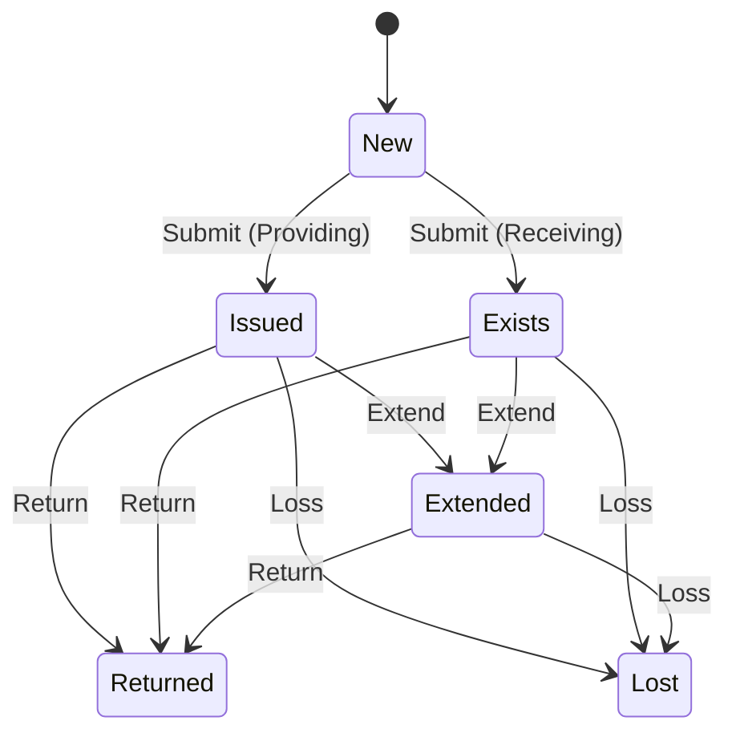
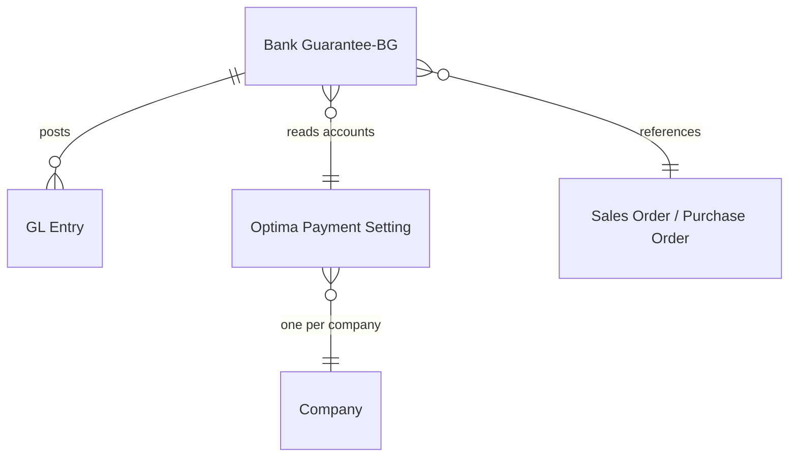

# Bank Guarantee

Developer + power-user reference for the **Bank Guarantee-BG** doctype. For a click-by-click
guide aimed at accountants, see [user-guide.md](user-guide.md).

> **Bank Guarantee vs Letter of Credit.** These two features are close cousins and share the
> same **Optima Payment Setting** accounts, but they differ in two important ways:
> 1. **Accounting** — Bank Guarantee posts **raw GL Entry rows** directly; Letter of Credit
>    posts via generated **Payment Entry** documents. See
>    [../letter-of-credit/reference.md](../letter-of-credit/reference.md).
> 2. **End states** — Bank Guarantee has a **Loss** action (status *Lost*); Letter of Credit
>    has **Close / Re-Open** instead.

---

## What it is

A Bank Guarantee records a bank-issued guarantee tied to a Sales Order (**Providing** — your
company arranges the guarantee) or a Purchase Order (**Receiving** — a supplier's guarantee
in your favour). It tracks validity, cash-margin collateral, and any issue commission, and
moves that collateral through the ledger as the guarantee is issued, extended, returned, or
lost.

Controller: `optima_payment/optima_payment/doctype/bank_guarantee_bg/bank_guarantee_bg.py`

Key classifying fields:

| Field | Values |
|-------|--------|
| `bg_type` | Providing, Receiving |
| `guarantee_type` | Initial, Final, Advanced Payment, Financial |
| `bank_guarantee_status` | New, Exists, Issued, Returned, Expired, Extended, Lost |

---

## How it books accounting — raw GL Entries

On submit and on each action, the controller writes `GL Entry` rows directly
(`erpnext.accounts.general_ledger.make_gl_entries`). It never creates a Journal Entry or
Payment Entry.

| Event | Providing | Receiving |
|-------|-----------|-----------|
| **Submit** | Dr Insurance account, Cr Bank account — for the **cash-margin amount**. Optional commission: Dr Bank Fees, Cr Bank account. | **No GL** (status just becomes *Exists*). |
| **Return** | Reverses the submit rows (swap Dr/Cr). Commission is **not** reversed. | — |
| **Extend** (with commission) | Dr Bank Fees, Cr Bank account — for the commission amount. | same |
| **Loss** | Reverses the submit rows, then Dr **Loss Expense**, Cr Bank account for the **guarantee amount**. | Dr Bank account, Cr **Receiving Insurance** for the guarantee amount. |

`Optima Payment Setting` (one record per company) supplies the four accounts, all validated
as mandatory before submit: `bank_guarantee_insurance_account`,
`bank_guarantee_receiving_insurance_account`, `bank_guarantee_bank_fees_account`,
`bank_guarantee_loss_expense_account`.

**Commission is never reversed** — it is a permanent bank cost, excluded from Return and Loss
reversals.

---

## Status lifecycle

---

## Whitelisted actions

| Method | Effect | Date rule |
|--------|--------|-----------|
| `bank_guarantee_return(returned_date)` | Reverses collateral GL (excludes commission); status → *Returned* | Not before the most recent transaction |
| `make_extend_action(amount, end_date, days, extend_to_date, has_commission)` | Bumps validity/commission; status → *Extended*; books a commission GL pair when `has_commission` | `extend_to_date` not before the most recent transaction |
| `make_loss_action(loss_date)` | Reverses collateral, books the loss pair; status → *Lost* | Not before the most recent transaction |

All dates are floored by `get_recent_transactoin_date()` — the latest linked GL date, else
the posting date.

---

## Entities

---

## Tests

See [../development/testing.md](../development/testing.md). The suite lives at
`optima_payment/optima_payment/doctype/bank_guarantee_bg/test_bank_guarantee_bg.py` and
asserts on the generated GL rows (`get_gle` / `validate_gl_entries`). Fixtures come from
`optima_payment/tests/utils.py` (`make_bank_guarantee_bg`, `make_optima_payment_setting`).
