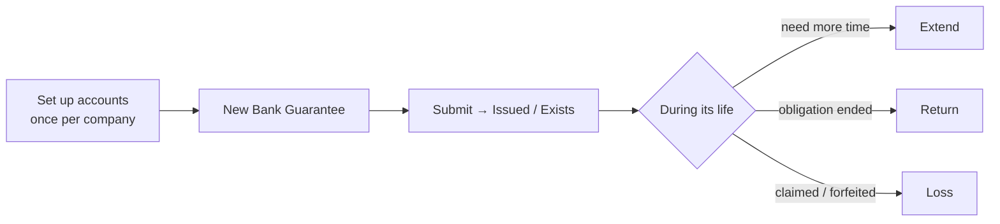

# Bank Guarantee — User Guide

A plain-language guide for accountants and implementers. For the accounting internals, see
[reference.md](reference.md).

---

## What a Bank Guarantee does here

It records a bank-issued guarantee and automatically moves its **cash-margin collateral**
through your accounts as the guarantee progresses — you never post the journal entries by
hand.

| Type | Use it when… | Linked to |
|------|--------------|-----------|
| **Providing** | Your company arranges a guarantee in a customer's favour | a **Sales Order** |
| **Receiving** | A supplier gives your company a guarantee | a **Purchase Order** |

---

## The happy path

---

## Before you start — one-time setup

Open **Optima Payment Setting** for your company and fill the four Bank Guarantee accounts:
**Insurance**, **Receiving Insurance**, **Bank Fees** (issue commission), and **Loss
Expense**. Without them the guarantee will not submit. (These are the same settings used by
Letter of Credit.)

---

## Create a Providing Bank Guarantee

1. New **Bank Guarantee-BG** → set **Type = Providing** and the **Guarantee Type** (Initial,
   Final, Advanced Payment, or Financial).
2. Pick the reference **Sales Order**; the customer and beneficiary fill in.
3. Enter **Posting/Start dates** and **Validity (days)** — the End Date is computed.
4. Choose the **Bank**, **Account**, and **Cost Center**.
5. Enter the amounts (order amount, guarantee percent → guarantee amount and cash margin).
6. *(Optional)* tick **Issue Commission** and enter the amount.
7. **Save**, then **Submit**. Status becomes **Issued** and the collateral is posted.

A **Receiving** guarantee is the same but references a **Purchase Order**; it posts no
collateral on submit and its status becomes **Exists**.

---

## Actions after submitting

Each action asks for a date that **cannot be earlier than the guarantee's most recent
transaction**.

| Button | What it does | Result |
|--------|--------------|--------|
| **Extend** | Prolongs validity, optionally adding commission | Status → **Extended** |
| **Return** | The obligation ended; releases the collateral | Status → **Returned** (commission kept) |
| **Loss** | The guarantee was claimed/forfeited | Status → **Lost**; books the loss expense |

There is a **Bank Guarantee Report** for monitoring all guarantees and their statuses.

---

## Troubleshooting

| Message | Cause | Fix |
|---------|-------|-----|
| *Select the customer or supplier.* | No party | Pick the reference order |
| *Enter the Bank Guarantee Number or name of the Beneficiary…* | Number/beneficiary empty | Fill both before submitting |
| *Please set the … Account under Optima Payment Setting.* | A required account is blank | Fill all four Bank Guarantee accounts on Optima Payment Setting |
| *Return / Extend / Loss date cannot be before …* | Date predates the last transaction | Use a date on or after the most recent linked entry |

---

## Related

- [reference.md](reference.md) — accounting model, diagrams, action signatures
- [../letter-of-credit/user-guide.md](../letter-of-credit/user-guide.md) — the closely
  related Letter of Credit feature
