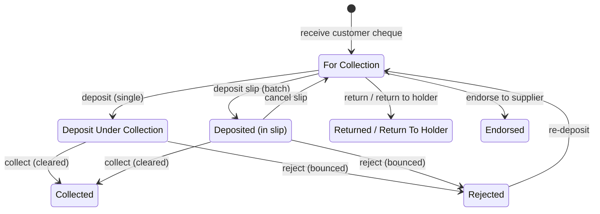
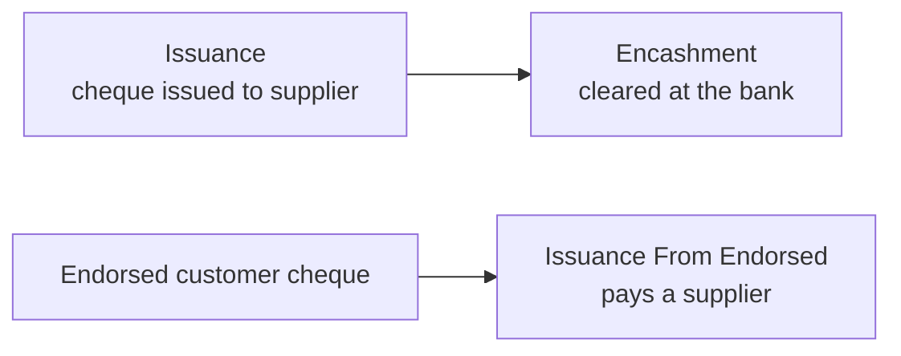

# Cheque Lifecycle

Developer reference for the cheque (post-dated cheque / PDC) subsystem. For accountant
workflows, see [user-guide.md](user-guide.md).

Unlike Bank Guarantee and Letter of Credit, the cheque feature is **not a dedicated
doctype** — it is a lifecycle layered on top of **Payment Entry** through custom fields, a
set of whitelisted actions, and a few supporting doctypes.

---

## The state field

A cheque's state lives in the `cheque_status` custom field on Payment Entry:

```
(blank) · For Collection · Deposit Under Collection · Deposited · Collected
Issuance · Encashment · Endorsed · Issuance From Endorsed
Rejected · Returned · Return To Holder · Cancelled
```

There are two tracks, distinguished by flags on the Payment Entry:

| Track | Flag | Meaning |
|-------|------|---------|
| **Receivable** | `is_receivable_cheque` | A cheque **received from a customer** |
| **Payable** | `is_payable_cheque` | A cheque **issued to a supplier** |
| **Endorsed** | `is_endorsed_cheque` + `receivable_cheque` | A received cheque **passed on** to pay a supplier |

Other cheque fields on Payment Entry: `cheque_no`, `cheque_date`, `cheque_details`,
`cheque_deposit_slip`, `cheque_collection_fee`, `cheque_rejection_fee`.

---

## Receivable (customer) cheque lifecycle



## Payable (supplier) cheque lifecycle



---

## Actions

Each whitelisted endpoint in `cheque/api.py` calls a GL builder in `cheque/cases.py`, which
posts the GL rows, sets the new `cheque_status`, and appends a **Cheque Action Log** entry.

| Endpoint (`cheque/api.py`) | Builder (`cheque/cases.py`) | New status |
|----------------------------|------------------------------|------------|
| `deposit_under_collection` | `make_deposit_under_collection_gl` | Deposit Under Collection |
| *(Cheque Deposit Slip submit)* | `make_cheque_slip_gl` | Deposited (cancel → For Collection) |
| `collect_cheque` | `make_collect_cheque_gl` | Collected (optional `bank_fees_commission`) |
| `reject_cheque` | `make_reject_cheque_gl` | Rejected (optional bank fee; unlinks the slip) |
| `redeposit_cheque` | *(status only)* | For Collection |
| `return_cheque` | `make_return_cheque_gl` | Returned |
| `return_to_holder` | `make_return_to_holder_gl` | Return To Holder |
| `pay_cheque` | `make_pay_cheque_gl` | Encashment |

---

## Supporting doctypes

| Doctype | Role |
|---------|------|
| **Cheque Deposit Slip** (submittable) + **Cheque Deposit Slip Items** (child) | Batch several *For Collection* receivable cheques and move them to *Deposited* in one document. Cancelling reverses them to *For Collection*. |
| **Cheque Action Log** | Read-only audit trail: one row per status transition (`payment_entry`, `cheque_status`, `posting_date`), kept in chronological order per Payment Entry. Written by `add_cheque_action_log`. Listed in `ignore_links_on_delete`. |
| **Cheque Accounts** (child table) | Per-company cheque account configuration used by the GL builders. |

---

## Module map

```
optima_payment/cheque/
  api.py                    # @frappe.whitelist() action endpoints (called from the PE form)
  cases.py                  # per-action GL builders (make_*_gl)
  utils.py                  # create_gl_entry / finalize_gl_entries (sets status + logs), money_to_words
  payment_entry_override.py # Payment Entry override: reconciliation / outstanding handling
```

`finalize_gl_entries()` is the common tail: it posts the rows, stamps the new
`cheque_status`, and records the Cheque Action Log entry. `payment_entry_override.py` also
excludes cheques in `Returned` / `Rejected` / `Return To Holder` from reconciliation.

---

## Cheque printing

Cheque printing is provided through **40+ print formats** (bank-specific cheque templates),
with `cheque/utils.py:money_to_words` (`in_words`) rendering the amount in words. New
templates can be added as Print Formats.

---

## Tests

See [../development/testing.md](../development/testing.md). Cheque GL is covered by
`optima_payment/tests/test_cheque_gl.py` and the Payment Entry override by
`optima_payment/tests/test_payment_entry_override.py`.
