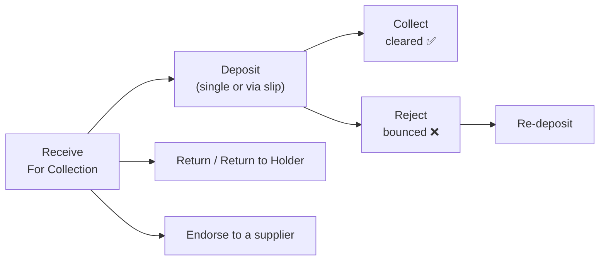

# Cheque — User Guide

A plain-language guide for accountants and implementers to managing post-dated cheques
(PDC). For the technical model, see [reference.md](reference.md).

Cheques are handled **on the Payment Entry** — you record a cheque payment, then use the
cheque action buttons to move it through its life. Every action posts the accounting for you
and writes an entry to the **Cheque Action Log** so there is a full history.

There are two sides: **customer (receivable) cheques** you receive, and **supplier (payable)
cheques** you issue.

---

## Customer cheques (received)

1. **Receive** — record the customer's cheque; it starts as **For Collection**.
2. **Deposit** — either **Deposit Under Collection** on the single cheque, or add several
   cheques to a **Cheque Deposit Slip** and submit it to move them all to **Deposited** at
   once.
3. **Collect** — when the bank clears it, use **Collect**; the cheque becomes **Collected**.
   You can record a bank **collection fee** here.
4. If it bounces, use **Reject** (record a bank **rejection fee** if any). A rejected cheque
   can be **re-deposited** (back to *For Collection*), **Returned** to the customer, or sent
   to **Return to Holder**.
5. Instead of banking it, you can **Endorse** a received cheque to pay a supplier.

## Supplier cheques (issued)

1. **Issue** a cheque to a supplier (**Issuance**).
2. When the bank pays it, mark it **Encashment**.
3. A supplier can also be paid with an endorsed customer cheque (**Issuance From Endorsed**).

---

## Cheque Deposit Slip (depositing in bulk)

Use a **Cheque Deposit Slip** to bank many customer cheques together:

1. New **Cheque Deposit Slip**, add the *For Collection* cheques as rows.
2. **Submit** — all listed cheques move to **Deposited**.
3. If you cancel the slip, those cheques go back to **For Collection**.

---

## Printing cheques

The app ships **40+ official cheque templates**. Pick the template matching your bank and
print the cheque directly from the system; the amount is rendered in words automatically.
New templates can be added as Print Formats.

---

## Where to look things up

- The **Cheque Action Log** shows the full dated history of every cheque's status changes.
- Reporting gives real-time visibility of all cheques and their current status.

---

## Related

- [reference.md](reference.md) — the `cheque_status` state machine, actions, and doctypes
