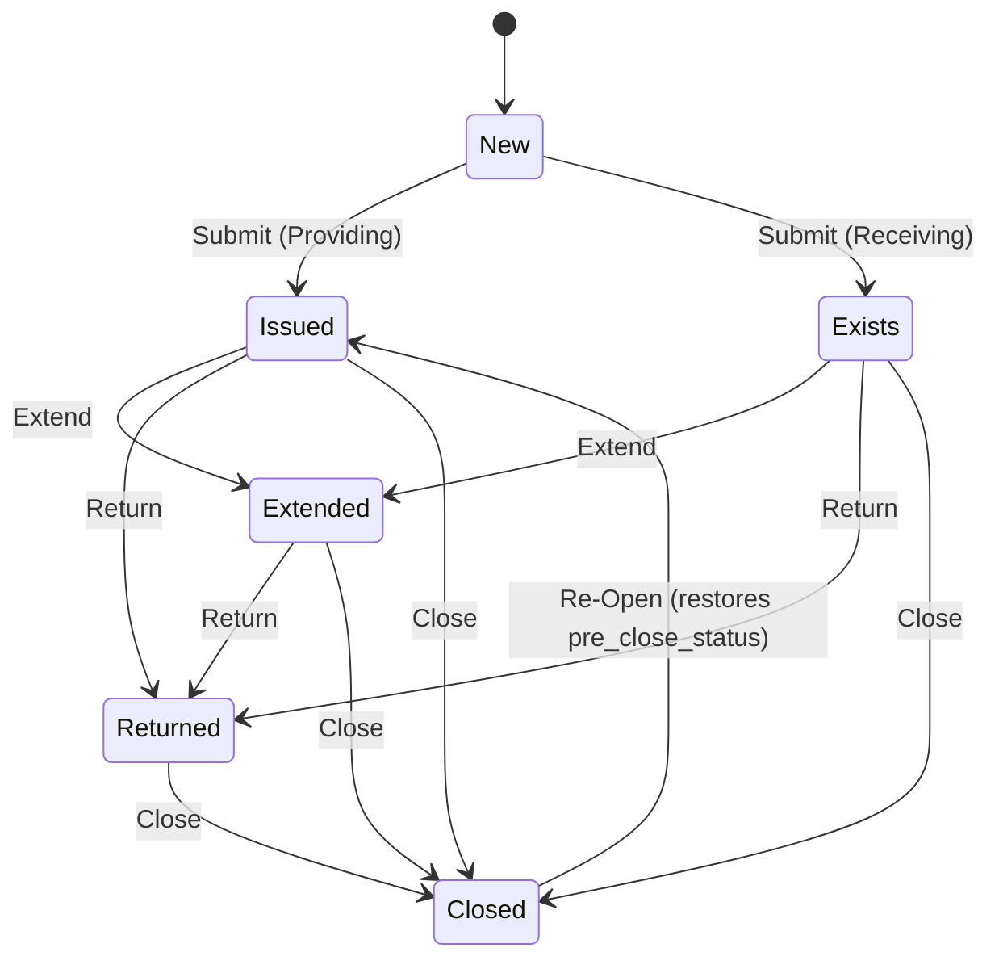
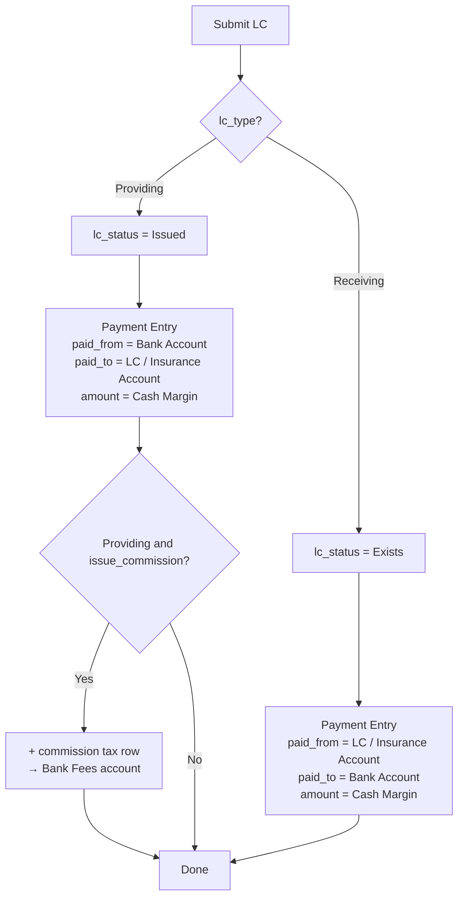
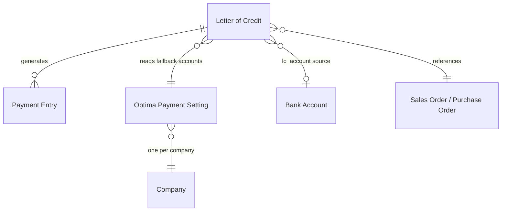

# Letter of Credit

Developer + power-user reference for the **Letter of Credit** (LC) doctype: its data
model, how it books accounting, and the lifecycle actions. For a click-by-click guide
aimed at accountants, see [user-guide-letter-of-credit.md](user-guide-letter-of-credit.md).

---

## What it is

A Letter of Credit records a bank-issued credit instrument tied to a Sales Order
(**Providing** — you are the beneficiary's counterparty) or a Purchase Order
(**Receiving** — a supplier holds the LC against you). The doctype tracks the LC's
validity, its cash-margin collateral, any issue commission, and moves that collateral
through the general ledger as the LC is issued, extended, returned, or closed.

Controller: `optima_payment/optima_payment/doctype/letter_of_credit/letter_of_credit.py`

---

## How it books accounting — Payment Entries, not raw GL

Unlike Bank Guarantee-BG (which writes raw `GL Entry` rows), Letter of Credit posts **all**
accounting impact by inserting and submitting **Payment Entry (Internal Transfer)**
documents. Each generated Payment Entry:

- links back to the LC through the custom `letter_of_credit` field, and
- is tagged with `is_system_generated = 1` plus one of the intent flags below.

| Flag on Payment Entry | Set when |
|-----------------------|----------|
| *(none)* | The initial collateral transfer booked on submit, and extend-amount transfers |
| `is_lc_commission_entry` | A standalone commission Payment Entry (validity-only extend) |
| `is_lc_return_entry` | A reversal booked by **Return** |
| `is_lc_close_entry` | The reversed-direction transfer booked by **Close** |
| `is_lc_loss_entry` | Reserved — see [Not yet wired](#not-yet-wired) |

Because submitting/cancelling a Payment Entry posts/reverses its own GL automatically, the
LC controller never touches `GL Entry` directly.

### Transfer direction

`get_payment_entry_accounts()` decides the two legs of the collateral transfer from the
LC type. `account` is the company's bank account on the LC; the collateral leg is
`lc_account` (fetched from the Bank Account's LC fields) or, if unset, the matching
insurance account on **Optima Payment Setting**.

| lc_type | Paid From | Paid To | Meaning |
|---------|-----------|---------|---------|
| **Providing** | `account` (bank) | `lc_account` / `lc_insurance_account` | Cash margin leaves the bank into collateral |
| **Receiving** | `lc_account` / `lc_receiving_insurance_account` | `account` (bank) | Collateral is released into the bank |

**Return** and **Close** reverse this direction to unwind the collateral.

### Commission is never reversed

Issue commission is a permanent bank cost. On submit (Providing) it is added as an
`Actual` tax row on the collateral Payment Entry, posting to
`lc_bank_fees_account`. Return/Cancel reverse only the collateral transfer — the
commission is deliberately **excluded** from every reversal.

---

## Status lifecycle

`lc_status` starts at **New** and is promoted on submit. **Close** remembers the prior
status in `pre_close_status` so **Re-Open** can restore it.

---

## Submit flow

---

## Whitelisted actions

| Method | Effect | Date rule |
|--------|--------|-----------|
| `lc_return(returned_date)` | Reverses collateral Payment Entries (excludes commission); `lc_status = Returned` | Not before the most recent linked transaction |
| `lc_extend_action(commission_amount, end_date, extended_days, extend_to_date, has_commission, has_amount_extension, lc_amount_extension, …)` | `lc_status = Extended`; bumps validity/commission; books an extend-amount transfer or a standalone commission PE | `extend_to_date` not before the most recent transaction |
| `lc_close_action(close_date, close_amount)` | Books a reversed-direction transfer; saves `pre_close_status`; `lc_status = Closed` | Not before the most recent transaction |
| `lc_reopen_action(reopen_date)` | Restores `pre_close_status`; clears it | Must currently be `Closed` |

All date rules are floored by `get_recent_transaction_date()` — the latest submitted linked
Payment Entry's posting date, falling back to the LC's own posting date.

---

## Entities

`Optima Payment Setting` (one record per company) supplies the four LC accounts:
`lc_insurance_account`, `lc_receiving_insurance_account`, `lc_bank_fees_account`, and
`lc_loss_expense_account`. All four are validated as mandatory before an LC can submit.

---

## Not yet wired

- **Loss** — `is_lc_loss_entry` and `lc_loss_expense_account` are plumbed through the
  Payment Entry builder but no `lc_loss_action` exists yet (Bank Guarantee-BG has one).
- **Mixed cost-center on the standalone commission entry** — the validity-only *extend
  with commission* path books a standalone Internal Transfer that puts both a Balance Sheet
  (bank) leg and a P&L (bank fees) leg under one cost center. Standard ERPNext accepts this,
  but installations that enforce stricter per-line cost-center rules may reject it. Folding
  the commission into a tax row (as the submit path already does) would be the durable fix.

---

## Tests

See [testing.md](testing.md). The suite lives at
`optima_payment/optima_payment/doctype/letter_of_credit/test_letter_of_credit.py` and
asserts on the generated Payment Entries. Fixtures come from
`optima_payment/tests/utils.py` (`make_letter_of_credit`, `make_optima_payment_setting`).
