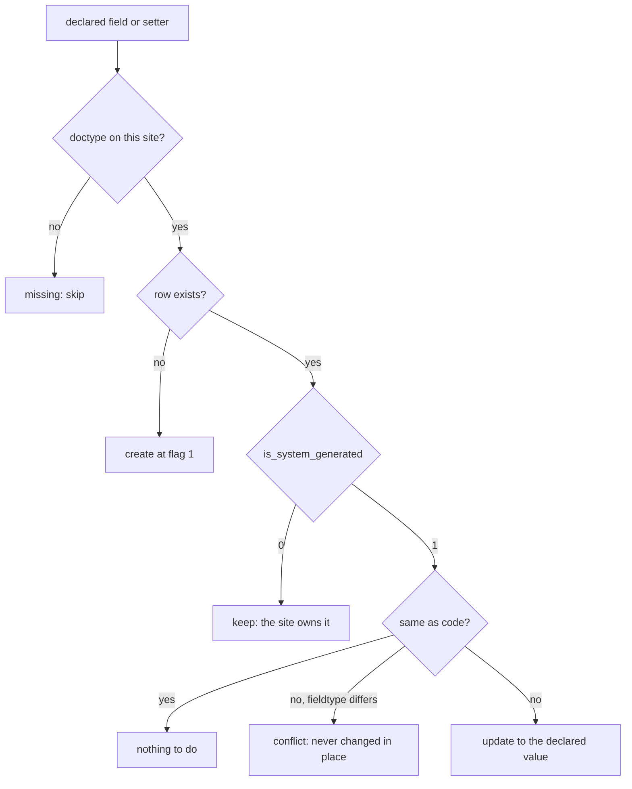

# Setup Architecture

Developer reference for how Optima Payment installs, updates and removes the custom fields and
property setters it adds to other apps' doctypes. For the short answers to common questions, see
[questions-and-answers.md](questions-and-answers.md).

---

## What "setup" means here

Optima Payment extends doctypes owned by other apps — Payment Entry, Bank Account, Bank Guarantee,
Mode of Payment. Those changes cannot live in this app's own DocType JSON, so they are declared in
code under `setup/features/` and written to the site as **Custom Field** and **Property Setter**
records.

Every site also has customizations the app did not make: what the client changed in **Customize
Form**. The setup system exists to keep the app's declarations up to date *without ever overwriting
those*.

---

## The ownership model

Frappe v15 marks each Custom Field and Property Setter row with `is_system_generated`:

| Flag | Written by | Means |
|------|-----------|-------|
| **1** | code (`create_custom_fields`, `frappe.make_property_setter`) | the app owns this row |
| **0** | Customize Form | the site owns this row |

Two rules follow, and everything in `setup/sync/` is an expression of them:

- **A declared Custom Field row at flag 1 belongs to the app.** When the client edits such a field
  in Customize Form, Frappe does not touch the Custom Field row; it writes the change as a separate
  Property Setter at flag 0. So the app can update its own row without losing the client's edit.
- **A declared Property Setter belongs to the app only while its row is still flag 1.** When the
  client edits that same key, Frappe replaces the row with a flag-0 one, and the app never touches
  it again.

A **key** identifies a row. It is not the value:

| Record | Key | Row name |
|--------|-----|----------|
| Custom Field | doctype + fieldname | `Payment Entry-payee_name` |
| Property Setter | doctype + field (or row) + property | `Payment Entry-payee_name-hidden` |

Inserting a Property Setter deletes any existing row with the same key, which is why "who owns this
key" is the only question that matters.

### One key, traced end to end

```
app declares Payment Entry.payee_name insert_after "reference_no"
   ↓  install → sync() creates the Custom Field row (flag 1)
client drags the field under "is_lc_close_entry" in Customize Form
   ↓  Frappe writes Property Setter "Payment Entry-payee_name-insert_after" (flag 0)
next migrate → sync() updates the Custom Field row, leaves the flag-0 setter alone
   ↓
the field stays where the client put it
```

> **Flag 0 does not always mean the client.** Older versions of this app, and old fixture imports,
> wrote app rows at flag 0 too. A flag-0 Property Setter that still holds exactly the declared value
> therefore carries no client edit: the one-time patch `adopt_existing_customizations` moved those to
> flag 1, and uninstall removes them. A flag-0 row with a *different* value is always left alone.

---

## Entry points

| Hook | File | What it does |
|------|------|--------------|
| `after_install` | `install.py → after_install()` | seeds print formats, patches Mode of Payment options, **`sync()`**, **`apply_starting_field_orders()`**, seeds roles and Custom DocPerms, imports any cheque artifact |
| `after_app_install` | `install.py → after_app_install(app_name)` | fires for every app installed later; does nothing unless it is `hrms`, then **`sync()`** and the HRMS permission grid |
| `after_migrate` | `migrate.py → after_migrate()` | re-applies the Mode of Payment option patch |
| `before_uninstall` | `uninstall.py → before_uninstall()` | **`remove_customizations()`**, then removes access control |

Nothing runs the sync on every migrate. Customizations reach installed sites through **patches**, one
per change — see [how-to-write-a-patch.md](how-to-write-a-patch.md).

### Fresh install

```
bench install-app optima_payment
  └── install.py: after_install()
        ├── standard_data.add_standard_data()          # print formats (install only)
        ├── standard_data.update_fields_in_database()  # Mode of Payment type options
        ├── sync.sync()                                # create every declared field and setter
        ├── sync.apply_starting_field_orders()         # field_order, only where the site has none
        ├── permissions.apply_access_control()         # roles + Custom DocPerms (install only)
        └── migration_artifact.import_cheque_legacy_artifact()
```

### Migrate

```
bench migrate
  ├── frappe: sync doctype schemas
  ├── frappe: run pending patches           # each one calls sync() after its own work
  ├── frappe: fixtures + customizations sync
  └── migrate.py: after_migrate()           # Mode of Payment options
```

### Uninstall

```
bench uninstall-app optima_payment
  └── uninstall.py: before_uninstall()
        ├── sync.remove_customizations()
        │     ├── every declared Custom Field   → deleted (Frappe deletes the setters on it too)
        │     └── every declared Property Setter → deleted only if flag 1, or flag 0 holding the
        │                                          declared value; a client value is kept
        └── permissions.remove_access_control()
```

---

## What `sync()` decides, per declared record



`field_order` never enters this flow at all; see the Q&A.

Every step returns a list of `Change(action, target, detail)` records and prints them:

| Action | Meaning |
|--------|---------|
| `create` | the row was missing and was created as app-owned |
| `update` | an app-owned row drifted from code and was set back |
| `keep` | the site owns this row; nothing was written |
| `conflict` | the site and the code disagree in a way the sync will not resolve (a fieldtype change, or two rows sharing one key) |
| `missing` | the doctype is not installed on this site |
| `remove` | uninstall deleted an app-owned row |
| `adopt` | the one-time adoption patch moved a row to flag 1 |

---

## Module map

```
install.py / migrate.py / uninstall.py     ← entry points, wired in hooks.py
setup/registry.py                          ← the feature list and which features this site enables
setup/sync/
    __init__.py                            ← sync, preview, apply_starting_field_orders,
    │                                        remove_customizations + the ownership rules
    declarations.py                        ← merge what the features declare, one entry per key
    custom_fields.py                       ← plan and apply Custom Field changes
    property_setters.py                    ← plan and apply Property Setter changes
    report.py                              ← the Change record and the printed report
setup/form_snapshot.py                     ← record every form before a migrate, compare after
setup/features/
    banking.py                             ← Bank, Bank Account, Letter Head, GL Entry
    payment_workflow.py                    ← Mode of Payment + Payment Entry
    bank_guarantee.py                      ← Bank Guarantee fields + property setters
    letter_of_credit.py                    ← Payment Entry LC fields + property setters
    hrms_integration.py                    ← Expense Claim Detail (only when hrms is installed)
setup/permissions.py                       ← Optima roles + Custom DocPerm grid (install only)
setup/standard_data.py                     ← print format seed + raw field option patches
setup/runner.py                            ← step execution with savepoints (used by permissions)
patches/adopt_existing_customizations.py   ← the one-time flag 0 → 1 move; adoption lives only here
```

A feature is a plain module: `get_custom_fields()` returns `dict[doctype, list[field]]`,
`get_property_setters()` returns `list[setter]`. The registry lists them:

```python
FeatureSpec(
    key="banking",
    get_custom_fields=banking.get_custom_fields,
    get_property_setters=banking.get_property_setters,   # omit if the feature has none
    enabled=lambda: _is_installed("hrms"),               # omit for always-on features
)
```

Declarations from all enabled features are merged by key. The same key declared twice with
different values raises `DeclarationConflict` and stops the sync — that is a bug in the
declarations, not a site problem.

---

## Three kinds of seeded state

| Kind | Declared in | Applied | Removed on uninstall? |
|------|-------------|---------|----------------------|
| **Customizations** — custom fields, property setters | `setup/features/*` | install + one patch per change | **Yes**, app-owned rows only |
| **Access control** — roles, Custom DocPerms | `setup/permissions.py` | install only | **Yes** |
| **Data seed** — print formats | `files/print_format.json` | install only | No — admins edit these per site |

Access control and the print formats are install-only on purpose: a later migrate must not
overwrite what an admin tuned on the site. The customization sync follows the same principle, but
it can still update the app's own rows because ownership is tracked per row.

---

## Running the sync by hand

```bash
# show what would change; writes nothing
bench --site <site> execute optima_payment.setup.sync.preview

# apply it
bench --site <site> execute optima_payment.setup.sync.sync
```

Use `preview` freely. Prefer a patch over running `sync` by hand, so every site gets the change the
same way — [how-to-write-a-patch.md](how-to-write-a-patch.md).
