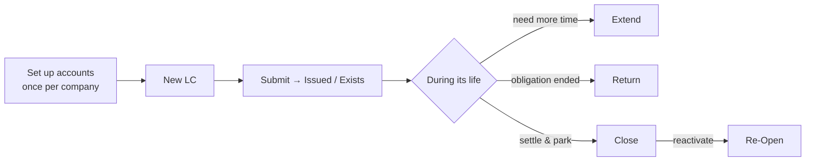

# Letter of Credit — User Guide

A plain-language guide for accountants and implementers. It explains what the Letter of
Credit (LC) form does, what you must set up first, and how to run each action. For the
technical/accounting internals, see [letter-of-credit.md](letter-of-credit.md).

---

## What a Letter of Credit does here

A Letter of Credit lets you record a bank credit instrument and automatically move its
**cash-margin collateral** through your accounts as the LC progresses. You never post
journal entries by hand — submitting the LC (and using its action buttons) creates the
Payment Entries for you.

There are two kinds:

| Type | Use it when… | Linked to |
|------|--------------|-----------|
| **Providing** | Your company arranges an LC in favour of a customer | a **Sales Order** |
| **Receiving** | A supplier requires an LC from your company | a **Purchase Order** |

---

## The happy path

---

## Before you start — one-time setup

Do these once per company. Without them, the LC will refuse to submit.

1. **Optima Payment Setting** (search it in the Awesomebar → pick your company). Fill the
   four Letter of Credit accounts:
   - **Provided Letter of Credit Account** (asset/collateral)
   - **Receiving Insurance Account**
   - **Bank Fees Account** (where issue commission is expensed)
   - **Loss Expense Account**
2. **Bank Account** — on the bank account you'll use, set the LC account fields
   (*Providing Letter of Credit Account* and/or *Receiving Letter of Credit Account*). The
   LC form pulls its collateral account from here based on the LC type.
3. **Mode of Payment** — make sure the Mode of Payment you'll pick has an account for this
   company. The LC requires a Mode of Payment before it can be submitted.

> **Tip for implementers:** these four accounts and the Bank Account fields are the most
> common reason a new site can't submit an LC. Confirm them during onboarding.

---

## Create a Providing LC (step by step)

1. New **Letter of Credit** → set **Type = Providing**.
2. Pick the **Reference** Sales Order; the customer and beneficiary fill in.
3. Enter **Posting Date**, **Start Date**, **Validity (days)** — the End Date is computed.
4. Choose the **Bank** and **Cost Center**; the bank **Account** and LC collateral account
   fill from the Bank Account setup.
5. Enter the **amounts**: the order amount, the LC percent (the LC amount and cash-margin
   amount compute from it).
6. Set the **Mode of Payment**.
7. *(Optional)* tick **Issue Commission** and enter the amount to expense a bank fee.
8. **Save**, then **Submit**. Status becomes **Issued** and the collateral Payment Entry is
   posted.

A **Receiving** LC is the same, but you pick a **Purchase Order** and supplier, and the
collateral moves in the opposite direction.

---

## Actions after submitting

After submit, the LC shows action buttons. Each asks for a date, which **cannot be earlier
than the LC's most recent transaction**.

| Button | What it does | Result |
|--------|--------------|--------|
| **Extend** | Prolongs validity. Optionally adds commission and/or increases the amount (with or without banking facilities). | Status → **Extended**; books the matching Payment Entry |
| **Return** | The obligation has ended and the collateral is released. | Status → **Returned**; reverses the collateral (commission is kept) |
| **Close** | Settle and park the LC. | Status → **Closed**; reverses the collateral. Remembers the previous status |
| **Re-Open** | Reactivate a closed LC. | Restores the status it had before Close |

---

## Troubleshooting

If submit or an action stops with a red message, match it here:

| Message | Cause | Fix |
|---------|-------|-----|
| *Select the customer or supplier.* | No party on the LC | Pick the reference order so the customer/supplier fills |
| *Enter the Letter of Credit Number or name of the Beneficiary…* | `LC Number` or `Beneficiary` empty | Fill both on the **Reference** tab |
| *Mode of Payment must be set.* | No Mode of Payment | Choose one (it needs an account for this company) |
| *Please set the … Account under Optima Payment Setting.* | A required LC account is blank | Open **Optima Payment Setting** for the company and fill all four LC accounts |
| *Please create Optima Payment Setting for company …* | No setting for this company | Create one and fill the LC accounts |
| *Return / Extend / Close date cannot be before …* | The date you entered predates the last transaction | Use a date on or after the most recent linked Payment Entry |
| *Cost Center must be empty / is required for Account …* | Site enforces strict cost-center rules and an *extend with commission* was attempted | See the note in [letter-of-credit.md](letter-of-credit.md#not-yet-wired); fold commission differently or contact your developer |

---

## Related

- [letter-of-credit.md](letter-of-credit.md) — technical reference (accounting model,
  diagrams, action signatures)
- [testing.md](testing.md) — how the automated tests exercise all of the above
